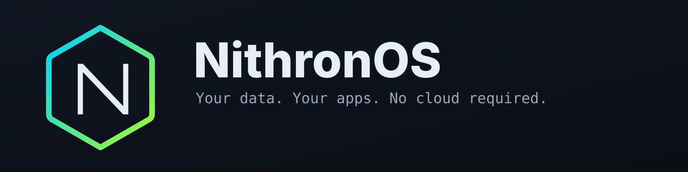

# NithronOS (nOS)

**Open-source Linux-based OS for NAS & homelabs.**  
Local-first storage management (Btrfs/ZFS*), snapshots, shares, backups, and a modern web dashboard with an optional app catalog — all without cloud lock-in.

> **Status:** v0.9.5 **pre-alpha** (public preview) - Real-time monitoring, health system, and Debian installer now available.

* ZFS availability depends on platform licensing constraints.

### ✨ What's New in v0.9.5-pre-alpha
- **🚀 Real-time Dashboard**: Live updates every second with smooth animations
- **📊 Health Monitoring**: System health, disk monitoring, and SMART status
- **💾 Storage Management**: Live storage metrics and pool health monitoring
- **🔧 Debian Installer**: Full working installation with automated setup
- **🎨 UI Improvements**: Fixed crashes, better navigation, and modern styling
- **📡 Remote & Monitoring**: Working backup system and monitoring dashboard

---

## Table of Contents
- [Why NithronOS?](#why-nithronos)
- [Architecture](#architecture)
- [Quickstart (Dev)](#quickstart-dev)
- [First Boot & Auth](#first-boot--auth)
- [Updates & Rollback](#updates--rollback)
- [ISO Build](#iso-build)
- [Firewall (LAN-only by default)](#firewall-lan-only-by-default)
- [Repository Structure](#repository-structure)
- [Roadmap](#roadmap)
- [Docs](#docs)
- [Contributing](#contributing)
- [Licensing & Commercial Use](#licensing--commercial-use)
- [Branding](#branding)
- [Contact](#contact)

---

## Why NithronOS?
- **Local-first, privacy-first** — admin UI served on your LAN by default; remote access is opt-in.
- **Btrfs-first** — snapshots, send/receive; optional ZFS via DKMS*.
- **NithronSync** — OneDrive-like file sync across Windows, Linux, macOS, iOS, and Android devices.
- **One-click apps** — Docker/Compose (Plex/Jellyfin, Nextcloud, Immich, etc.).
- **Real safety features** — dry-run plans, pre-update snapshots, easy rollback.
- **Clean UX** — React dashboard with real-time updates, clear health/status, sensible defaults.
- **Live monitoring** — 1Hz refresh rates, system health, disk monitoring, and live activity feeds.

---

## Architecture
- **`nosd`** (Go): REST API for disks, pools, snapshots, shares, sync, jobs, and real-time health metrics.
- **`nos-agent`** (Go, root): allow-listed helper for privileged actions.
- **Web UI** (React + TypeScript): talks to `nosd` via OpenAPI client with React Query for live updates.
- **NithronSync**: Cross-platform file sync with device token authentication, delta sync, and WebDAV access.
- **Reverse proxy** (Caddy): serves UI, proxies API, and provides WebDAV endpoints for sync clients.
- **Jobs**: systemd timers for snapshots/prune & scheduled maintenance.
- **Real-time monitoring**: gopsutil integration for live system metrics, health endpoints, and dashboard aggregation.

**Related docs:**  
API/versioning & typed errors → [docs/api/versioning-and-errors.md](docs/api/versioning-and-errors.md)  
Config & safe hot reload → [docs/dev/config-and-reload.md](docs/dev/config-and-reload.md)  
Recovery mode (admin access) → [docs/dev/recovery-mode.md](docs/dev/recovery-mode.md)  
Pre-Alpha Recovery Checklist → [RECOVERY-CHECKLIST.md](RECOVERY-CHECKLIST.md)  
Storage pools (create/import/encrypt & device ops) → [docs/storage/pools.md](docs/storage/pools.md)  
Storage health (SMART, scrub, schedules) → [docs/storage/health.md](docs/storage/health.md)  
Health monitoring → [docs/monitoring.md](docs/monitoring.md) (real-time system and disk metrics)  
Observability → [docs/dev/observability.md](docs/dev/observability.md) (scrape combined metrics via `/metrics/all`)  
**NithronSync** → [docs/sync/overview.md](docs/sync/overview.md) (cross-platform file synchronization)

---

## Quickstart (Dev)
**Requires:** Go 1.23+, Node 20+, npm, make (optional), Docker (for app catalog dev)

    # clone
    git clone https://github.com/Nithronverse/NithronOS.git
    cd NithronOS

    # web deps
    cd web && npm install && cd ..

    # backend (terminal 1)
    make api-dev

    # agent (terminal 2, optional)
    make agent-dev

    # web (terminal 3)
    make web-dev

- Backend: http://127.0.0.1:9000  
- Web dev (Vite): http://127.0.0.1:5173

> Security: keep `nosd` bound to loopback in dev. If you expose remotely, enforce 2FA + rate limits and use the LAN-only firewall by default.

---

## First Boot & Auth
On first boot, `nosd` generates a **one-time OTP**, logs it, and prints it to the console (`StandardOutput=journal+console`). The UI calls `/api/setup/state` and routes to `/setup` if required.

1. **OTP** — enter the 6-digit code (15-minute TTL).  
2. **Admin** — create the first admin (strong password with real-time strength indicator).  
3. **2FA (optional)** — TOTP QR + recovery codes.  
4. **Telemetry** — opt-in/opt-out for system improvement data collection.
5. **Done** — sign in at `/login`.

After the first admin is created, `/api/setup/*` returns **410 Gone** and normal login applies.

> **Improved Setup Experience**: The welcome screen is now properly centered with step-by-step navigation and visual progress indicators.

**Frontend Features**
- **Smart error handling** — Specific messages for rate limiting, invalid credentials, TOTP required
- **Session management** — Automatic token refresh on 401, no manual re-login needed
- **Global error banner** — Backend unreachable detection with help link
- **Password strength meter** — Real-time feedback during account creation
- **Remember me** — Optional persistent sessions using localStorage

**Where things live**
- Users DB: `/etc/nos/users.json` (remove to rerun setup).  
- Secret key: `/etc/nos/secret.key` (`0600`).  
- First-boot state: `/var/lib/nos/state/firstboot.json`.

**Security defaults**
- Passwords: **Argon2id** (PHC).  
- Sessions: httpOnly cookies (`nos_session` ~15m, optional `nos_refresh` ~7d) + CSRF double-submit (`X-CSRF-Token`).  
- 2FA: TOTP (XChaCha20-Poly1305-encrypted secrets), recovery codes hashed.  
- Guardrails: rate limits per IP/username, generic auth errors, temporary lockout.

📚 For detailed implementation: [Authentication Guide](docs/frontend/authentication.md) | [Migration Guide](docs/frontend/auth-migration-guide.md)

---

## Updates & Rollback
Pre-update snapshots and rollback are **built-in and enabled**.

- Config file: `/etc/nos/snapshots.yaml` (dev default: `./devdata/snapshots.yaml`)
- Targets include Btrfs subvols (**ro snapshots**) or generic paths (**tarball snapshots**).
- A transaction index is appended at `/var/lib/nos/snapshots/index.json`.
- Retention: newest **N=5** per target by default (daily prune timer).

See [docs/updates.md](docs/updates.md) for workflow and CLI.

---

## ISO Build
Build a bootable ISO (Debian live) with NithronOS preinstalled.

    # 1) Build local .debs (to dist/deb)
    bash packaging/build-all.sh

    # 2) Build ISO (stages local debs automatically)
    sudo bash packaging/iso/build.sh packaging/iso/local-debs

    # Output -> dist/iso/nithronos-<tag>-<date>-amd64.iso

> **UEFI / Secure Boot:** The preview ISO is not shim-signed yet. **Disable Secure Boot** in your VM/UEFI (e.g., Hyper-V Gen2 → uncheck *Enable Secure Boot*). If your platform can’t disable it, use a legacy/BIOS VM for now.

At first boot the system prints the UI URL + one-time OTP to the console.

Boot menu provides:
- **NithronOS Live** (default)
- **Install NithronOS (Debian Installer - Text)** — text frontend, `fb=false nomodeset` to avoid KMS blank screens
- **Install NithronOS (Safe graphics)** — text frontend, `nomodeset` fallback
- **Install NithronOS (Serial console @ttyS0)** — text frontend on serial
The Debian Installer is fully functional with preseed automation and service auto-enablement.

> **Hyper-V:** Use “NithronOS Live”. The “Kernel fallback (no ACPI)” entry is **not** for Hyper-V; use “safe graphics” instead if you only need to disable GPU modesetting.

---

## Firewall (LAN-only by default)
NithronOS ships an **nftables** policy exposing the web UI (443) to LAN (RFC1918) only.

    sudo bash deploy/firewall/apply.sh
    sudo systemctl enable --now nftables.service

This:
- Loads `deploy/firewall/nos.nft`
- Sets **default-deny** on input
- Allows loopback + established/related
- Allows TCP **443** (web UI) and **22** (SSH) **from LAN only**  
  (`10.0.0.0/8`, `172.16.0.0/12`, `192.168.0.0/16`)

> **Remote access is opt-in.** For Internet access (VPN/Tunnel/Direct), use the **Remote** wizard: enforce 2FA, add rate limits, update firewall atomically, keep rollback backups.

Revert manually:

    sudo nft flush ruleset
    sudo systemctl restart nftables.service

**Optional brute-force protection (fail2ban)**  
Filters/jails under `deploy/fail2ban/`; see comments inside for enabling.

---

## Repository Structure

    /backend/nosd          # Go API server
    /agent/nos-agent       # Privileged helper (Unix socket)
    /web                   # React + TypeScript dashboard
    /clients/desktop       # Cross-platform desktop client (Wails + Go)
    /clients/mobile        # Cross-platform mobile app (React Native)
    /clients/sync-core     # Shared sync engine library (Go)
    /packaging/deb         # Debian packaging for nosd/agent/web
    /packaging/iso/debian  # Debian live-build profile (installer ISO)
    /scripts               # CI/build/release tools, helpers
    /docs                  # Architecture notes, guides

---

## Roadmap

### v0.9.5-pre-alpha ✅ (Current Release)
- **Real-time Dashboard**: Live 1Hz updates, system health, storage monitoring, disk health, recent activity
- **Health Monitoring System**: Dedicated health pages with real-time metrics and SMART monitoring
- **Debian Installer**: Full working installation flow with preseed automation
- **UI/UX Improvements**: Fixed all major crashes, improved button styles, better navigation
- **Remote & Monitoring**: Working remote backup system and monitoring dashboard

### Pre-v1 / NithronSync ✅ (Complete)
- [x] **Server Foundation**: Sync API endpoints, device token authentication, WebDAV access, delta sync algorithm
- [x] **Web UI**: Device management, sync settings, QR code generation for mobile setup
- [x] **Desktop Clients**: Windows, Linux, macOS sync applications with system tray integration
- [x] **Mobile Apps**: iOS and Android apps with QR code setup, file browser, offline support
- [x] **Collaboration**: Conflict resolution UI, shared folder collaboration, sync activity history

### Post-v1 / Alpha
- [ ] **A1 — Reliability & Telemetry (opt-in)**: Crash reports (symbolized), perf traces, health pings; redaction; one-click diagnostics.
- [ ] **A2 — App Catalog v2 (Safety & Lifecycle)**: Per-app permissions, resource limits, atomic upgrades/rollbacks, health retries, hooks.
- [ ] **A3 — Backup & Replication v2 (Cloud + Immutability)**: S3/Backblaze providers; seed/restore; snapshot locking/retention; verification; key mgmt.
- [ ] **A4 — Directory Services & SSO**: LDAP/AD join; SMB ACL mapping; OIDC login for web UI; group-based share permissions.
- [ ] **A5 — iSCSI & Advanced NFS/SMB**: iSCSI targets (CHAP); NFS v4.1 + Kerberos; SMB Time Machine polish; per-share recycle bin.
- [ ] **A6 — Remote Access Plus**: WireGuard profiles + QR; optional reverse tunnel; dynamic DNS; device tokens; 2FA gating.
- [ ] **A7 — Hardware, Power & UPS**: NUT integration; scheduled shutdown/wake; sensors/temps/fan; CPU governor controls.
- [ ] **A8 — Observability & Alerts v2**: Prometheus exporter, ready-made Grafana dashboards; audit log shipping; more alert channels.
- [ ] **A9 — Extensibility & SDK v2**: Signed app bundles; nosctl improvements; app lifecycle webhooks; review tools.
- [x] **A10 — NithronSync v2**: Real-time collaboration, end-to-end encryption, offline-first sync, smart sync (on-demand files).

> Each milestone ships release notes, migration notes, E2E suite green (HTTP/UI/backup/upgrade), and no data-loss regressions.

---

## Docs

### User Guides
- NithronSync overview → [docs/sync/overview.md](docs/sync/overview.md)
- NithronSync client setup → [docs/sync/client-setup.md](docs/sync/client-setup.md)
- NithronSync troubleshooting → [docs/sync/troubleshooting.md](docs/sync/troubleshooting.md)
- Shares & Permissions → [docs/user/shares-permissions.md](docs/user/shares-permissions.md)

### Administration
- API versioning & typed errors → [docs/api/versioning-and-errors.md](docs/api/versioning-and-errors.md)  
- App Catalog user guide → [docs/apps/catalog.md](docs/apps/catalog.md)  
- App implementation guide → [docs/apps/implementation.md](docs/apps/implementation.md)
- App runtime architecture → [docs/apps/runtime.md](docs/apps/runtime.md)  
- Backup system → [docs/backup.md](docs/backup.md)
- NithronSync API reference → [docs/sync/api.md](docs/sync/api.md)
- NithronSync security → [docs/sync/security.md](docs/sync/security.md)
- Certificates & HTTPS configuration → [docs/admin/certificates.md](docs/admin/certificates.md)  
- Configuration management → [docs/admin/config.md](docs/admin/config.md)
- First boot experience → [docs/admin/first-boot.md](docs/admin/first-boot.md) / [docs/first-boot.md](docs/first-boot.md)
- HTTPS setup → [docs/admin/https.md](docs/admin/https.md)
- Login and sessions → [docs/admin/login-and-sessions.md](docs/admin/login-and-sessions.md)
- Monitoring system → [docs/monitoring.md](docs/monitoring.md)
- Network shares (SMB/NFS/Time Machine) → [docs/admin/shares.md](docs/admin/shares.md)  
- Networking & Remote Access → [docs/networking.md](docs/networking.md)
- Recovery procedures → [docs/admin/recovery.md](docs/admin/recovery.md)
- System installer → [docs/installer.md](docs/installer.md)
- System Updates & Releases → [docs/updates.md](docs/updates.md)  
- Storage pools (device add/remove/replace, destroy, mount options) → [docs/storage/pools.md](docs/storage/pools.md)  
- Storage health (SMART alerts & thresholds, schedules, fstrim) → [docs/storage/health.md](docs/storage/health.md)  
- Security model → [docs/security-model.md](docs/security-model.md)
- System requirements → [docs/requirements.md](docs/requirements.md)

### Development
- API development → [docs/dev/api.md](docs/dev/api.md)
- Branching & releases → [docs/dev/branching-release.md](docs/dev/branching-release.md)
- Build & packaging → [docs/dev/build-and-packaging.md](docs/dev/build-and-packaging.md)
- CI/CD pipeline → [docs/dev/ci.md](docs/dev/ci.md)
- Config & hot reload → [docs/dev/config-and-reload.md](docs/dev/config-and-reload.md)
- FS atomic operations → [docs/dev/fsatomic-verification.md](docs/dev/fsatomic-verification.md)
- Observability → [docs/dev/observability.md](docs/dev/observability.md)
- Rate limiting → [docs/dev/ratelimit-verification.md](docs/dev/ratelimit-verification.md)
- Real data wiring → [docs/dev/real-data-wiring.md](docs/dev/real-data-wiring.md)
- Recovery mode → [docs/dev/recovery-mode.md](docs/dev/recovery-mode.md)

### Frontend
- Authentication guide → [docs/frontend/authentication.md](docs/frontend/authentication.md)
- Auth migration guide → [docs/frontend/auth-migration-guide.md](docs/frontend/auth-migration-guide.md)

### QA & Testing
- M1 milestone checklist → [docs/qa/m1-checklist.md](docs/qa/m1-checklist.md)
- Pre-Alpha Recovery Checklist → [RECOVERY-CHECKLIST.md](RECOVERY-CHECKLIST.md)

---

## Contributing
We welcome issues and PRs! Please read:
- [CONTRIBUTING.md](CONTRIBUTING.md)
- [SECURITY.md](SECURITY.md)

All contributions are made under the **NithronOS Community License (NCL)**; see [LICENSE](LICENSE).

---

## Licensing & Commercial Use
- **Source code:** [LICENSE](LICENSE) (NithronOS Community License — non-commercial, source-available)  
- **Commercial & MSP terms:** [COMMERCIAL.md](COMMERCIAL.md)  
- **Official builds (ISOs/packages/updates):** [BINARIES-EULA.md](BINARIES-EULA.md)  
- **Trademarks:** [TRADEMARK_POLICY.md](TRADEMARK_POLICY.md)

> TL;DR — read/modify/contribute freely; selling/hosting/redistributing binaries requires a commercial agreement.

---

## Branding
Colors align with Nithron’s palette (dark UI, electric blue `#2D7FF9`, lime `#A4F932`).  
“Nithron”, “NithronOS”, and “nOS” are trademarks of Nithron — see [TRADEMARK_POLICY.md](TRADEMARK_POLICY.md).

---

## Contact
General: hello@nithron.com  
Commercial: licensing@nithron.com  
Security: security@nithron.com  
Community (Discord): https://discord.gg/qzB37WS5AT  
Patreon: https://patreon.com/Nithron  
