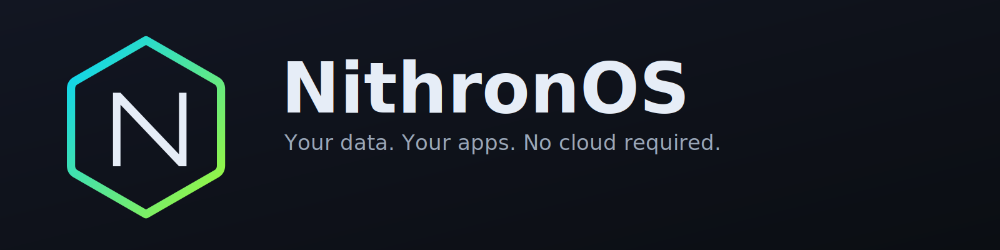

# NithronOS (nOS)


[](https://github.com/NotTekk/NithronOS/actions/workflows/ci.yml)
[](docs/updates.md)
[](https://github.com/NotTekk/NithronOS/releases/tag/v0.1.0-pre-alpha)

**Open-source Linux-based OS for NAS & homelabs.**  
Local-first storage management (Btrfs/ZFS*), snapshots, shares, backups, and a modern web dashboard with an optional app catalog — all without cloud lock-in.

> **Status:** v0 public preview.

---

## Why NithronOS?
- **Local-first, privacy-first** — admin UI served on your LAN by default; remote access is opt-in.
- **Btrfs-first** (snapshots, send/receive); optional ZFS via DKMS*.
- **One-click apps** via Docker/Compose (Plex/Jellyfin, Nextcloud, Immich, etc.).
- **Real safety features** — dry-run plans for destructive ops, pre-update snapshots, easy rollback.
- **Clean UX** — modern React dashboard, clear health/status, sensible defaults.

* ZFS availability depends on platform licensing constraints.

---

## High-level Architecture
- **`nosd`** (Go): REST API for disks, pools, snapshots, shares, jobs.
- **`nos-agent`** (Go, root): tiny allowlisted helper for privileged actions.
- **Web UI** (React + TypeScript): talks to `nosd` via OpenAPI client.
- **Reverse proxy** (Caddy): TLS, headers, rate limits; backend bound to loopback.
- **Jobs**: systemd timers for snapshots/prune and scheduled maintenance.

**Docs:**
- API Versioning, Typed Errors, OpenAPI: [docs/api/versioning-and-errors.md](docs/api/versioning-and-errors.md)
- Config and Safe Hot Reload (YAML + env): [docs/dev/config-and-reload.md](docs/dev/config-and-reload.md)
- Recovery Mode (Admin Access): [docs/dev/recovery-mode.md](docs/dev/recovery-mode.md)
- Pre-Alpha Recovery Checklist: [RECOVERY-CHECKLIST.md](RECOVERY-CHECKLIST.md)

**Remote access (opt-in):**
1) VPN (WireGuard/Tailscale) — recommended  
2) Cloudflare Tunnel — no port-forward, requires 2FA  
3) Direct port-forward — forces 2FA + rate limits

> WARNING: Remote modes (Tunnel or Direct) MUST enforce strong 2FA on the admin UI and apply rate limits. Exposing the dashboard without 2FA is unsupported and unsafe.

---

## Quickstart (Dev)
> Requires: Go 1.23+, Node 20+, npm, make (optional), Docker (for app catalog dev)

~~~bash
# clone
git clone https://github.com/NotTekk/NithronOS.git
cd NithronOS

# install deps
cd web && npm install && cd ..

# backend (in one terminal)
make api-dev

# agent (optional, separate terminal)
make agent-dev

# web (separate terminal)
make web-dev
~~~

- Backend default: `http://127.0.0.1:9000`  
- Web dev server: `http://127.0.0.1:5173` (Vite)

---

## First Boot & Auth (Setup)

On first boot, `nosd` generates a one-time 6‑digit OTP, logs it, and prints it to the console (unit uses `StandardOutput=journal+console`). The UI calls `/api/setup/state` on load and routes to `/setup` when required.

Setup steps:
- **Step 1: OTP** — Enter the OTP (valid 15 minutes). A temporary setup token is issued; it is kept only in memory by the UI.
- **Step 2: Admin** — Create the first admin (username + strong password). Optionally choose to enable 2FA now.
- **Step 3: 2FA (optional)** — Scan the TOTP QR (or use manual secret), enter a 6‑digit code to verify, and save the shown recovery codes.
- **Step 4: Done** — Sign in at `/login`.

After the first admin is created, all `/api/setup/*` routes return `410 Gone` and the normal login applies.

### Credentials location and reset
- Users database: `/etc/nos/users.json` (versioned schema).  
  Remove this file to rerun the first-boot setup on next start (recovery).  
  Secret key for encryption/cookies: `/etc/nos/secret.key` (32 bytes; `0600`).
- First‑boot state: `/var/lib/nos/state/firstboot.json` (stores the temporary OTP and usage).

### Security defaults
- Passwords: **Argon2id** (PHC format) with safe defaults.
- Sessions: httpOnly cookies (`nos_session` 15m, optional `nos_refresh` 7d) and CSRF cookie (`nos_csrf`) with double‑submit (`X‑CSRF‑Token`).
- 2FA: TOTP enrollment/verification with encrypted secrets (XChaCha20‑Poly1305); recovery codes stored as SHA‑256 hashes only.
- Guardrails: in‑memory rate limiting per IP and username, generic auth errors, and temporary account lockout after repeated failures.

---

## Local Dev

~~~bash
# run API with live reload (air/reflex if installed, else plain go)
make api-dev

# run agent (optional)
make agent-dev

# run web dev server
make web-dev

# run both nosd and web concurrently
bash scripts/dev-up.sh

# package .debs (Debian toolchain required)
make package
~~~

> Security: keep `nosd` bound to loopback in dev. For any remote exposure, enforce 2FA and rate limits, and apply the LAN-only firewall by default.

---

## Snapshot retention

NithronOS keeps a rolling set of the newest snapshots per target.

- Agent provides a prune endpoint that keeps the newest N snapshots (default 5) for each target and removes older ones (Btrfs subvolumes and `.tar.gz` snapshots).
- A systemd timer (`nos-snapshot-prune.timer`) runs daily and triggers the prune service.
- You can trigger pruning manually from the API:

```bash
curl -sS --unix-socket /run/nos-agent.sock -X POST http://localhost/v1/snapshot/prune -H 'Content-Type: application/json' -d '{"keep_per_target":5}'
```

Future versions will surface retention settings in the UI.

---

## Updates & Rollback

Pre-update snapshots and rollback are built-in and enabled by default.

- Configuration file: `/etc/nos/snapshots.yaml` (dev default: `./devdata/snapshots.yaml`).
  - Schema (v1):
    - `version: 1`
    - `targets[]`: entries with `{ id, path (absolute), type: "btrfs"|"auto"|"tar", stop_services?: [names...] }`
  - Example defaults in dev: `/etc/nos` (tar), `/opt/nos/apps` (auto), `/srv/apps` (auto if present).
- What gets snapshotted:
  - For `type: auto`, the agent detects if the path is on Btrfs; it creates a read-only subvolume snapshot under `path/.snapshots/<ts>-pre-update`. Otherwise a tarball is created under `/var/lib/nos/snapshots/<slug(path)>/<ts>-pre-update.tar.gz`.
  - Optional `stop_services` can be used to briefly stop services during snapshot (restarted after).
- Apply updates:
  - The backend takes pre-update snapshots for configured targets, then applies Debian updates (`apt-get install -y <pkgs>` or `apt-get upgrade -y`).
  - A transaction record (`tx_id`, packages, targets, result) is appended to `/var/lib/nos/snapshots/index.json`.
- Rollback behavior:
  - For each target in the transaction, the agent restores from the corresponding pre-update snapshot:
    - Btrfs: replaces the current subvolume with a writable clone of the snapshot.
    - Tar: extracts the tarball over the target path (a safety backup of current content is created first).
- Retention:
  - By default, the newest 5 snapshots are kept per target. Older snapshots are pruned daily by `nos-snapshot-prune.timer`.
  - You can trigger pruning manually via the API (see below) or from the UI (Settings → Updates).

See `docs/updates.md` for CLI examples and troubleshooting.

---

## ISO build

You can build a bootable ISO (Debian live) with NithronOS preinstalled.

Prereqs: Debian/Ubuntu with `live-build` and standard tooling.

```bash
# 1) Build local .debs (outputs to dist/deb)
bash packaging/build-all.sh

# 2) Build ISO (stages local debs automatically)
sudo bash packaging/iso/build.sh packaging/iso/local-debs

# Output: dist/iso/NithronOS - <arch> - <tag>.iso
```

On first boot, a first-boot service generates TLS certs, enables required services, and prints the UI URL + one-time OTP to the console.

---

## Firewall (LAN-only by default)

NithronOS ships with an **nftables** policy that exposes the web UI (443) only to LAN subnets (RFC1918). To apply it on a fresh Debian install:

~~~bash
sudo bash deploy/firewall/apply.sh
sudo systemctl enable --now nftables.service
~~~

This:
- Loads `deploy/firewall/nos.nft`
- Sets **default-deny** on input
- Allows loopback and established/related
- Allows TCP **443** (web UI) and **22** (SSH) **from LAN only** (`10.0.0.0/8`, `172.16.0.0/12`, `192.168.0.0/16`)

> **Remote access is opt-in.** When you later enable Internet access (VPN/Tunnel/Direct), use the **Remote** wizard in the UI (coming soon). It will enforce 2FA, add rate limiting, update firewall rules safely, and keep a rollback backup.

To revert the ruleset manually:

~~~bash
sudo nft flush ruleset
sudo systemctl restart nftables.service
~~~

### Brute-force protection (fail2ban)

Enable request rate-limiting and fail2ban for auth endpoints in production:

- Caddy logs JSON to `/var/log/caddy/access.log` and rate-limits `/api/auth/*` and the SPA `/login` route.
- fail2ban jail and filter are provided:
  - `deploy/fail2ban/filter.d/caddy-nithronos.conf`
  - `deploy/fail2ban/jail.d/nithronos.local`

Apply and enable fail2ban:

~~~bash
sudo install -d -o caddy -g caddy /var/log/caddy
sudo systemctl daemon-reload
sudo systemctl enable --now caddy
sudo cp -r deploy/fail2ban/* /etc/fail2ban/
sudo systemctl enable --now fail2ban
sudo fail2ban-client reload
sudo fail2ban-client status caddy-nithronos
~~~

---

## Repository Structure
~~~text
/backend/nosd          # Go API server (REST/gRPC, OpenAPI)
/agent/nos-agent       # Privileged helper (Unix socket)
/web                   # React + TypeScript dashboard (shadcn/ui)
/packaging/deb         # Debian packaging for nosd/agent/web
/packaging/iso/debian  # Debian live-build profile (installer ISO)
/scripts               # CI/build/release tools, support bundle
/docs                  # Architecture notes, ADRs, guides
~~~

---

## Roadmap

### Pre-M1 (Hardening & Quality)
- [x] Run nosd as system user + hardened systemd unit (least-privilege).
- [x] Robust auth storage (atomic writes / optional SQLite).
- [x] Session/refresh hardening (server-side session IDs, rotate refresh, reuse detection).
- [x] Rate limits persisted across restarts + proxy awareness (X-Forwarded-For when trusted).
- [x] API versioning `/api/v1`, typed error shape, initial OpenAPI spec.
- [x] Config system `/etc/nos/config.yaml` + env overrides + safe hot reload (SIGHUP).
- [x] Observability: request IDs, structured logs, `/metrics` (Prometheus), gated `/debug/pprof`.
- [x] Security headers (CSP, HSTS, Referrer-Policy, X-Content-Type-Options, COOP/COEP).
- [x] Frontend resilience & a11y (CSRF/refresh guard, toasts, focus, contrast).
- [x] CI upgrades (linters, govulncheck, TypeScript check, stronger ISO smoke).
- [x] Packaging polish (sysusers/tmpfiles/postinst/postrm, console OTP visibility).
- [x] Agent ↔ daemon trust bootstrap (token or mTLS, rotation).
- [x] Recovery paths (console/TUI: reset admin/2FA, `nos.recovery=1`).
- [x] Threat model doc + fuzz/property tests.

Highlights delivered:
- [Auth & Sessions](docs/admin/login-and-sessions.md)
- [Config & Hot Reload](docs/admin/config.md)
- [Security Model](docs/dev/security-model.md)
- [Metrics & Debug](docs/dev/observability.md)
- [Recovery](docs/admin/recovery.md)

Docs:
- [First Boot](docs/admin/first-boot.md)
- [API](docs/dev/api.md)
- [Build & Packaging](docs/dev/build-and-packaging.md)
- [CI](docs/dev/ci.md)
- [Branching & Release](docs/dev/branching-release.md)

### Milestones to v1
- [ ] M1 — Storage Foundation (Btrfs + Health): Pool wizard (create/import), optional LUKS-on-Btrfs, SMART, scrub/repair, schedules.
- [ ] M2 — Shares & Permissions: SMB/NFS with simple ACLs, guest toggle, recycle bin, optional Time Machine (fruit).
- [ ] M3 — App Catalog v1 (Docker/Compose): One-click apps, lifecycle, health checks, pre-snapshot + rollback.
- [ ] M4 — Networking & Remote Access: Remote Access Wizard (LAN-only, WireGuard VPN, reverse tunnel), HTTPS (LE), firewall profiles with plan/apply/rollback and 2FA for non-LAN.
- [ ] M5 — Updates & Releases Hardening: Signed packages, channels (stable/beta), atomic upgrades (snapshot rollback safety net).
- [ ] M6 — Installer & First-boot Wizard++: Guided disk install (Btrfs subvols), hostname/timezone/network, telemetry opt-in.
- [ ] M7 — Backup & Replication: Scheduled snapshots + retention; send/receive (SSH), optional cloud (rclone), restore wizard.
- [ ] M8 — Monitoring & Alerts: Dashboard (CPU/RAM/IO), disk temps/SMART, scrub status, service health, notifications (email/webhook/ntfy), auth audit log.
- [ ] M9 — Security Hardening (User-facing): Account management UI (password change, 2FA reset, regenerate recovery); password reset (console/admin); audit log UI; session list & revoke.
- [ ] M10 — Extensibility & API: `nosctl` CLI, OpenAPI, scoped API tokens, app-template SDK.
- [ ] M11 — QA, CI, Docs (v1 Gate): ISO boot + HTTP/SSH/Btrfs E2E in CI, UI E2E (Playwright), N-1→N upgrade tests, full docs site.

See the dedicated guide: [Updates & Rollback](docs/updates.md).

---

## Contributing
We welcome issues and PRs! Please read:
- [`CONTRIBUTING.md`](CONTRIBUTING.md)
- [`SECURITY.md`](SECURITY.md)

All contributions are made under the **NithronOS Community License (NCL)**; see `LICENSE`.

---

## Licensing & Commercial Use
- **Source code:** [`LICENSE`](LICENSE) (NithronOS Community License — non-commercial, source-available)  
- **Commercial & MSP terms:** [`COMMERCIAL.md`](COMMERCIAL.md)  
- **Official builds (ISOs/packages/updates):** [`BINARIES-EULA.md`](BINARIES-EULA.md)  
- **Trademarks:** [`TRADEMARK_POLICY.md`](TRADEMARK_POLICY.md)

> TL;DR: you can read/modify/contribute freely; selling, hosting, or redistributing binaries requires a commercial agreement.

---

## Branding
Colors align with Nithron’s palette (dark UI, electric blue `#2D7FF9`, lime accent `#A4F932`).  
“Nithron”, “NithronOS”, and “nOS” are trademarks of Nithron — see `TRADEMARK_POLICY.md`.

---

## Contact
General: **hello@nithron.com**  
Commercial licensing: **licensing@nithron.com**  
Security: **security@nithron.com**
