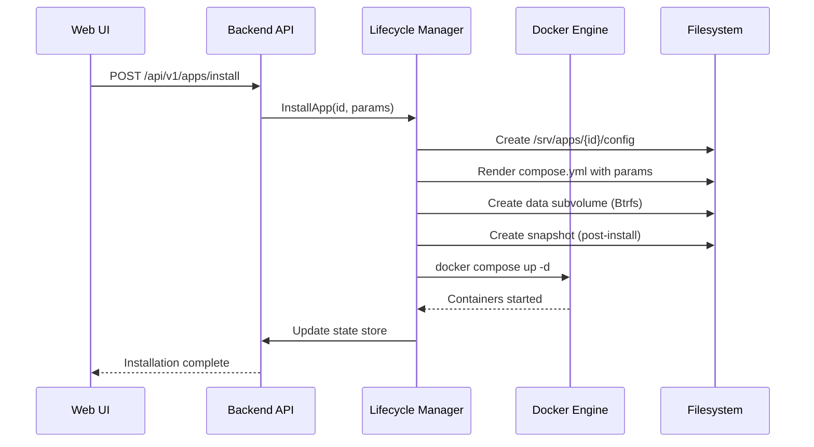
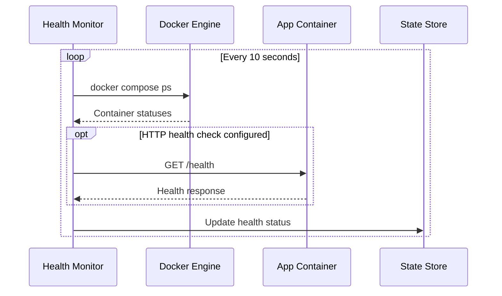

# M3 App Catalog Implementation

## Overview

The M3 milestone implements a complete Docker-based application platform for NithronOS, providing one-click app deployment with health monitoring, snapshots, and rollback capabilities.

## Architecture

### Components

```
┌─────────────────────────────────────────────────────────────┐
│                         Web UI (React)                       │
│  ┌──────────────┐  ┌────────────────┐  ┌──────────────┐   │
│  │ App Catalog  │  │ Install Wizard │  │ App Details  │   │
│  │   Grid View  │  │  Multi-step    │  │  Health/Logs │   │
│  └──────────────┘  └────────────────┘  └──────────────┘   │
└─────────────────────────────────────────────────────────────┘
                              │
                              ▼
┌─────────────────────────────────────────────────────────────┐
│                    Backend API (Go)                          │
│  ┌──────────────┐  ┌────────────────┐  ┌──────────────┐   │
│  │   Catalog    │  │   Lifecycle    │  │    Health    │   │
│  │   Manager    │  │    Manager     │  │   Monitor    │   │
│  └──────────────┘  └────────────────┘  └──────────────┘   │
└─────────────────────────────────────────────────────────────┘
                              │
                              ▼
┌─────────────────────────────────────────────────────────────┐
│                    Runtime (Docker)                          │
│  ┌──────────────┐  ┌────────────────┐  ┌──────────────┐   │
│  │ Docker Engine│  │ Compose Plugin │  │ Systemd Units│   │
│  └──────────────┘  └────────────────┘  └──────────────┘   │
└─────────────────────────────────────────────────────────────┘
```

## Package Structure

### `nos-apps-runtime`

Debian package providing the Docker runtime environment:

- **Docker Configuration**: Hardened daemon.json with security defaults
- **Systemd Integration**: Templated units for app lifecycle
- **CLI Helpers**: Shell scripts for Docker/Compose operations
- **Snapshot Management**: Btrfs-aware snapshots with rsync fallback

### Backend (`nosd`)

Go implementation providing REST APIs:

#### Data Types (`pkg/apps/types.go`)
- `CatalogEntry`: App metadata and requirements
- `InstalledApp`: Runtime state and configuration
- `HealthStatus`: Container and service health
- `AppSnapshot`: Backup points for rollback

#### Core Managers

1. **CatalogManager** (`pkg/apps/catalog.go`)
   - Loads built-in catalog from `/usr/share/nithronos/apps`
   - Merges remote catalogs from `/etc/nos/apps/catalogs.d`
   - Verifies SHA256 hashes and signatures

2. **LifecycleManager** (`pkg/apps/lifecycle.go`)
   - Handles install/upgrade/rollback operations
   - Creates pre-operation snapshots
   - Manages systemd service lifecycle
   - Integrates with Caddy for reverse proxy

3. **HealthMonitor** (`pkg/apps/health.go`)
   - Periodic health checks (10s interval)
   - Container status monitoring
   - HTTP endpoint health checks
   - Updates state store with results

4. **StateStore** (`pkg/apps/state.go`)
   - Persistent app state in `/var/lib/nos/apps/state/apps.json`
   - Atomic writes with fsync
   - Snapshot tracking

5. **TemplateRenderer** (`pkg/apps/renderer.go`)
   - Renders Compose templates with variables
   - Validates parameters against JSON Schema
   - Applies security defaults
   - Generates Caddy configuration

### Frontend (`web`)

React components with TypeScript:

#### Pages

1. **AppCatalog** (`pages/AppCatalog.tsx`)
   - Grid view with category filtering
   - Search functionality
   - Installed apps management tab
   - Quick actions (start/stop/restart)

2. **AppInstallWizard** (`pages/AppInstallWizard.tsx`)
   - Multi-step installation flow:
     1. Overview and requirements
     2. Configuration with schema validation
     3. Storage setup
     4. Review and install
   - Client-side validation
   - Real-time error feedback

3. **AppDetails** (`pages/AppDetails.tsx`)
   - Health monitoring dashboard
   - Live log streaming via WebSocket
   - Configuration viewer
   - Snapshot management with rollback
   - Danger zone for deletion

#### API Client (`api/apps.ts`)
- Type-safe API calls
- WebSocket support for logs
- Error handling

## Data Flow

### Installation Flow



### Health Monitoring



## Security Model

### Container Isolation

All containers run with:
- `no-new-privileges`: Prevent privilege escalation
- `read_only: true`: Read-only root filesystem (unless required)
- Resource limits: CPU/memory constraints
- User namespaces: UID/GID remapping

### Network Security

- Default deny for dynamic port bindings
- Only explicitly mapped ports exposed
- Reverse proxy via Caddy for path-based routing
- CSRF protection for API endpoints

### Data Protection

- Automatic snapshots before mutations
- Atomic filesystem operations
- Encrypted secrets storage
- Audit logging of all operations

## File Locations

### Configuration
- `/etc/nos/apps/`: App management configuration
- `/etc/nos/apps/catalogs.d/`: Remote catalog sources
- `/etc/docker/daemon.json`: Docker daemon config

### Data
- `/srv/apps/{id}/config/`: Rendered Compose files
- `/srv/apps/{id}/data/`: App persistent data
- `/srv/apps/.snapshots/`: Snapshot storage
- `/var/lib/nos/apps/state/`: Runtime state

### System
- `/usr/share/nithronos/apps/`: Built-in catalog
- `/usr/lib/nos/apps/`: Helper scripts
- `/lib/systemd/system/nos-app@.service`: Systemd template

## Testing

### Unit Tests
- Schema validation
- Template rendering
- State persistence
- Health check logic

### Integration Tests
- App installation flow
- Snapshot and rollback
- Health monitoring
- Proxy integration

### E2E Tests (Cypress)
- Catalog browsing
- Installation wizard
- App management
- Health monitoring UI

## API Endpoints

### Catalog
- `GET /api/v1/apps/catalog`: Get merged catalog
- `POST /api/v1/apps/catalog/sync`: Sync remote catalogs

### Lifecycle
- `POST /api/v1/apps/install`: Install new app
- `POST /api/v1/apps/{id}/upgrade`: Upgrade app
- `POST /api/v1/apps/{id}/start`: Start app
- `POST /api/v1/apps/{id}/stop`: Stop app
- `POST /api/v1/apps/{id}/restart`: Restart app
- `POST /api/v1/apps/{id}/rollback`: Rollback to snapshot
- `DELETE /api/v1/apps/{id}`: Delete app

### Monitoring
- `GET /api/v1/apps/installed`: List installed apps
- `GET /api/v1/apps/{id}`: Get app details
- `GET /api/v1/apps/{id}/logs`: Stream logs
- `GET /api/v1/apps/{id}/events`: Get app events
- `POST /api/v1/apps/{id}/health`: Force health check

## Sample Applications

### Whoami
Simple HTTP service for testing:
- Minimal configuration
- Health endpoint
- Read-only container

### Nextcloud
Full-featured collaboration platform:
- PostgreSQL database
- Redis cache
- Multiple containers
- Complex configuration

### Jellyfin
Media server:
- Large data volumes
- Hardware acceleration support
- Network discovery

## Future Enhancements

- [ ] Kubernetes runtime option
- [ ] Multi-node orchestration
- [ ] App marketplace with ratings
- [ ] Automated backup to cloud
- [ ] Resource usage analytics
- [ ] App-to-app networking policies
- [ ] Certificate management for apps
- [ ] GitOps-style deployments
