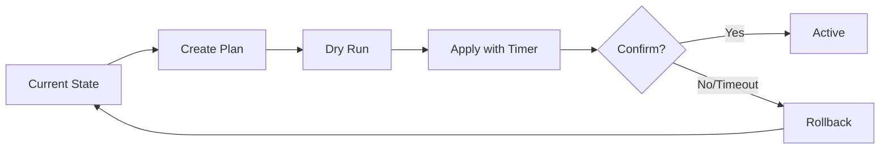

# Networking & Remote Access

## Overview

NithronOS provides comprehensive networking features for secure remote access:

- **LAN-only mode** (default): Restricts access to local network only
- **WireGuard VPN**: Secure remote access through encrypted tunnel
- **Public HTTPS**: Internet-accessible with Let's Encrypt certificates
- **Firewall management**: Declarative rules with automatic rollback
- **2FA enforcement**: TOTP-based authentication for non-LAN sessions

## Access Modes

### LAN-Only Mode (Default)

The most secure configuration, limiting access to RFC1918 private networks:
- `192.168.0.0/16`
- `10.0.0.0/8`
- `172.16.0.0/12`

**Firewall rules:**
```
Allow: LAN → UI/API (ports 80, 443)
Block: WAN → UI/API
```

### WireGuard VPN

Enables secure remote access without exposing the UI to the internet.

**Requirements:**
- UDP port forwarding (default: 51820)
- Public IP or dynamic DNS hostname

**Configuration:**
```yaml
subnet: 10.8.0.0/24      # VPN client IP range
listen_port: 51820       # UDP port
endpoint: vpn.example.com # Public hostname/IP
dns: [1.1.1.1, 1.0.0.1]  # DNS for clients
```

**Firewall rules:**
```
Allow: UDP port 51820 (WireGuard)
Allow: VPN subnet → UI/API
Block: WAN → UI/API
```

### Public HTTPS

Exposes NithronOS to the internet with SSL/TLS encryption.

**Requirements:**
- Domain name pointing to server
- Ports 80/443 accessible (or DNS-01 challenge)
- Valid email for Let's Encrypt

**Certificate modes:**
- **HTTP-01**: Requires open ports 80/443
- **DNS-01**: No ports required, needs DNS API access

**Firewall rules:**
```
Allow: TCP ports 80, 443
Enforce: 2FA for non-LAN sessions
```

## Remote Access Wizard

The wizard guides you through configuration:

1. **Access Mode Selection**
   - Choose between LAN-only, WireGuard, or Public HTTPS
   - Review security implications

2. **Configuration**
   - WireGuard: Set subnet, port, endpoint
   - HTTPS: Configure domain, email, challenge type

3. **Security Review**
   - Preview firewall changes
   - Understand 2FA requirements

4. **Apply & Test**
   - Automatic rollback timer (60 seconds)
   - Confirmation required to persist changes

## Firewall Management

### Plan/Apply/Rollback Model



### API Endpoints

```bash
# Get current state
GET /api/v1/net/firewall/state

# Create plan
POST /api/v1/net/firewall/plan
{
  "desired_mode": "wireguard",
  "enable_wg": true,
  "enable_https": false
}

# Apply plan (60s rollback timer)
POST /api/v1/net/firewall/apply
{
  "plan_id": "...",
  "rollback_timeout_sec": 60
}

# Confirm changes
POST /api/v1/net/firewall/confirm

# Manual rollback
POST /api/v1/net/firewall/rollback
```

### nftables Integration

Rules are managed via `/etc/nithronos/firewall.nft`:

```nft
table inet filter {
    chain input {
        type filter hook input priority 0; policy drop;
        
        # Allow loopback
        iif lo accept
        
        # Allow established
        ct state established,related accept
        
        # Allow LAN to UI
        ip saddr 192.168.0.0/16 tcp dport { 80, 443 } accept
        
        # Allow WireGuard
        udp dport 51820 accept
    }
}
```

## WireGuard VPN

### Server Configuration

Located at `/etc/wireguard/wg0.conf`:

```ini
[Interface]
PrivateKey = <server_private_key>
Address = 10.8.0.1/24
ListenPort = 51820
PostUp = iptables -A FORWARD -i %i -j ACCEPT
PostDown = iptables -D FORWARD -i %i -j ACCEPT

[Peer]
PublicKey = <client_public_key>
PresharedKey = <preshared_key>
AllowedIPs = 10.8.0.2/32
```

### Client Management

```bash
# Add peer
POST /api/v1/net/wg/peers/add
{
  "name": "John's Laptop",
  "allowed_ips": ["10.8.0.2/32"]
}

# Response includes QR code and config
{
  "qr_code": "data:image/png;base64,...",
  "config": "[Interface]\n..."
}
```

### Client Configuration

Generated `.conf` file for WireGuard clients:

```ini
[Interface]
PrivateKey = <client_private_key>
Address = 10.8.0.2/32
DNS = 1.1.1.1, 1.0.0.1

[Peer]
PublicKey = <server_public_key>
PresharedKey = <preshared_key>
Endpoint = vpn.example.com:51820
AllowedIPs = 0.0.0.0/0, ::/0
PersistentKeepalive = 25
```

## HTTPS/TLS Configuration

### Caddy Integration

Configuration managed via `/etc/caddy/Caddyfile`:

```caddyfile
{
    email admin@example.com
    acme_ca https://acme-v02.api.letsencrypt.org/directory
}

nas.example.com:443 {
    tls {
        # Automatic HTTPS with Let's Encrypt
    }
    
    # Security headers
    header {
        Strict-Transport-Security "max-age=31536000"
        X-Content-Type-Options "nosniff"
        X-Frame-Options "DENY"
    }
    
    # Proxy to backend
    handle /api/* {
        reverse_proxy localhost:9000
    }
    
    # Serve frontend
    handle {
        root * /usr/share/nithronos/web
        try_files {path} /index.html
        file_server
    }
}
```

### Certificate Modes

#### Self-Signed (Default)
- Automatic generation
- No domain required
- Browser warning expected

#### HTTP-01 Challenge
- Requires ports 80/443 open
- Domain must resolve to server
- Automatic renewal

#### DNS-01 Challenge
- No ports required
- Supports wildcard certificates
- Requires DNS provider API access

Supported providers:
- Cloudflare
- Route53
- DigitalOcean
- Others via environment variables

### API Configuration

```bash
POST /api/v1/net/https/configure
{
  "mode": "http_01",
  "domain": "nas.example.com",
  "email": "admin@example.com"
}
```

## Two-Factor Authentication (2FA)

### TOTP Implementation

- Algorithm: TOTP (RFC 6238)
- Period: 30 seconds
- Digits: 6
- Skew: ±1 period

### Enrollment Process

1. **Password verification**
2. **QR code generation**
3. **Code verification**
4. **Backup codes (10x single-use)**

### Session Management

Non-LAN detection:
```go
func IsLANIP(ip net.IP) bool {
    // Check RFC1918 ranges
    // 10.0.0.0/8, 172.16.0.0/12, 192.168.0.0/16
    // fc00::/7 (IPv6 ULA)
}
```

Session elevation:
- 2FA required for non-LAN admin operations
- 30-minute elevated session after verification
- Backup codes for recovery

### API Endpoints

```bash
# Check status
GET /api/v1/auth/2fa/status

# Enroll (requires password)
POST /api/v1/auth/2fa/enroll
{
  "password": "current_password"
}

# Verify code
POST /api/v1/auth/2fa/verify
{
  "code": "123456"
}

# Regenerate backup codes
POST /api/v1/auth/2fa/backup-codes
```

## Security Considerations

### Port Security

Default open ports by mode:

| Mode | Ports | Purpose |
|------|-------|---------|
| LAN-only | None (LAN only) | UI/API access |
| WireGuard | UDP 51820 | VPN tunnel |
| Public HTTPS | TCP 80, 443 | HTTP/HTTPS |

### 2FA Enforcement

Required for non-LAN when:
- Public HTTPS is enabled
- Accessing admin functions
- Modifying system settings

Exceptions:
- LAN connections (RFC1918)
- VPN connections (WireGuard subnet)
- Read-only operations

### Firewall Safety

Automatic rollback prevents lockouts:
- 60-second timer by default
- Requires explicit confirmation
- Backup configuration preserved
- Journal logging of all changes

## Troubleshooting

### Common Issues

#### WireGuard Connection Failed

1. Check port forwarding:
   ```bash
   sudo nft list ruleset | grep 51820
   ```

2. Verify service status:
   ```bash
   systemctl status wg-quick@wg0
   ```

3. Test handshake:
   ```bash
   wg show wg0
   ```

#### HTTPS Certificate Issues

1. Domain validation:
   ```bash
   nslookup nas.example.com
   ```

2. Port accessibility:
   ```bash
   nc -zv nas.example.com 80
   nc -zv nas.example.com 443
   ```

3. Caddy logs:
   ```bash
   journalctl -u caddy -f
   ```

#### Firewall Locked Out

1. Physical/console access:
   ```bash
   nft flush ruleset
   systemctl restart nosd
   ```

2. Safe mode boot:
   - Add `nos.firewall=disabled` to kernel parameters
   - Disables firewall enforcement

### CGNAT Considerations

If behind CGNAT (Carrier-Grade NAT):
- HTTP-01 challenge won't work
- Use DNS-01 challenge instead
- Consider IPv6 if available
- WireGuard may need STUN/TURN

### Performance Tuning

WireGuard optimization:
```bash
# Increase buffer sizes
sysctl -w net.core.rmem_max=26214400
sysctl -w net.core.wmem_max=26214400

# MTU discovery
ping -M do -s 1472 <endpoint>
```

Caddy optimization:
```caddyfile
# Enable HTTP/2
servers {
    protocols h1 h2 h3
}

# Compression
encode gzip zstd
```

## Monitoring

### Metrics Exposed

Prometheus endpoints at `/metrics`:

```
# Firewall
nos_firewall_rules_total{type="allow"} 5
nos_firewall_rules_total{type="deny"} 2
nos_firewall_rollbacks_total 0

# WireGuard
nos_wireguard_peers_total 3
nos_wireguard_bytes_rx_total{peer="..."} 1234567
nos_wireguard_bytes_tx_total{peer="..."} 7654321
nos_wireguard_last_handshake{peer="..."} 1234567890

# HTTPS
nos_https_cert_expiry_seconds 2592000
nos_https_renewals_total 5

# 2FA
nos_2fa_enrollments_total 10
nos_2fa_verifications_total{result="success"} 45
nos_2fa_verifications_total{result="failure"} 3
```

### Logging

All networking events logged to journal:

```bash
# View firewall changes
journalctl -u nosd | grep firewall

# View WireGuard activity
journalctl -u wg-quick@wg0

# View Caddy/HTTPS
journalctl -u caddy

# View 2FA events
journalctl -u nosd | grep 2fa
```

## Migration Guide

### From v1 (manual iptables)

1. Export existing rules:
   ```bash
   iptables-save > /tmp/iptables.rules
   ```

2. Convert to nftables:
   ```bash
   iptables-restore-translate < /tmp/iptables.rules
   ```

3. Run Remote Access Wizard

### From other VPN solutions

#### OpenVPN → WireGuard
- Export client certificates
- Generate WireGuard keys
- Map subnet configuration
- Update client configs

#### IPSec → WireGuard
- Note shared secrets
- Plan subnet migration
- Update firewall rules
- Test with parallel operation
